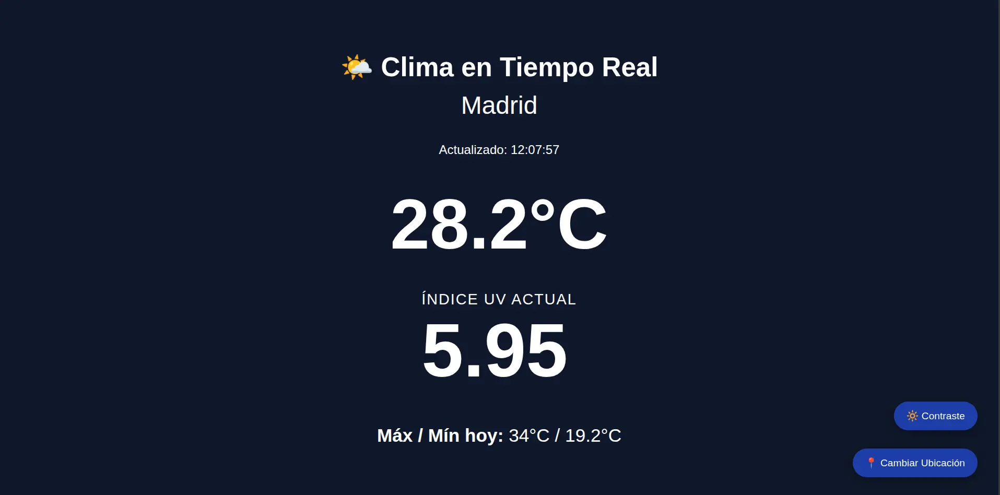
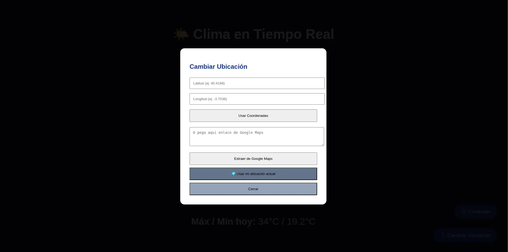

# 🌤️ Meteorológico - Servidor de Clima en Tiempo Real

Servidor web que proporciona información meteorológica actualizada en tiempo real, incluyendo temperatura, índice UV, humedad y más. Obtiene datos de Open-Meteo API y detecta automáticamente la ubicación del usuario.

## 📸 Preview

<div align="center">
  
  
</div>

## ✨ Características

- **Detección automática de ubicación** basada en IP del cliente
- **Datos meteorológicos en tiempo real**: temperatura, sensación térmica, humedad, viento, precipitación
- **Índice UV actual** y temperaturas máximas/mínimas del día
- **Actualización automática** cada 5 minutos en el servidor
- **Interfaz web moderna** con tres modos de visualización:
  - **Normal**: Fondo oscuro para uso en interiores
  - **Alto Contraste**: Fondo claro para mejor legibilidad
  - **Ultra**: Fondo negro con colores brillantes para uso en exteriores con sol
- **Cambio manual de ubicación** mediante coordenadas o enlaces de Google Maps
- **Geolocalización del navegador** para usar ubicación actual del usuario
- **Responsive**: Adaptado para dispositivos móviles y escritorio

## 🚀 Requisitos

- Node.js 18+ (usa módulos ES6)
- npm o yarn
- Conexión a internet (usa APIs externas)

## 📦 Instalación

1. Clona o descarga este repositorio:
```bash
git clone git@github.com:Ziruxltd/weather-for-copec.git
cd weather-for-copec
```

2. Instala las dependencias:
```bash
npm install
```

## 🎯 Uso

### Modo desarrollo (con auto-recarga)
```bash
npm run dev
```

### Modo producción
```bash
npm start
```

El servidor iniciará en `http://localhost:3000`

## 🚀 Despliegue en Producción (Render.com)

Este proyecto está preparado para desplegarse fácilmente en [Render.com](https://render.com).

### Opción 1: Despliegue con `render.yaml` (recomendado)

1. Haz fork o sube el código a un repositorio de GitHub.
2. En Render, ve a **New → Blueprint** y selecciona tu repositorio.
3. Render detectará automáticamente el archivo `render.yaml` y creará el servicio.
4. **Obligatorio**: Configura las variables de entorno `DEFAULT_LAT` y `DEFAULT_LON` con las coordenadas de la estación COPEC que quieras mostrar.

### Opción 2: Despliegue manual (Web Service)

1. En Render crea un nuevo **Web Service**.
2. Conecta tu repositorio de GitHub.
3. Configuración recomendada:
   - **Environment**: `Node`
   - **Build Command**: `npm install`
   - **Start Command**: `npm start`
   - **Health Check Path**: `/health`
   - **Region**: Frankfurt (mejor latencia hacia Chile que Oregon)
4. Agrega las siguientes variables de entorno:
   - `NODE_ENV` = `production`
   - `DEFAULT_LAT` = (latitud de tu estación)
   - `DEFAULT_LON` = (longitud de tu estación)

### Recomendaciones importantes para COPEC

- Siempre define `DEFAULT_LAT` y `DEFAULT_LON` explícitamente.
- El endpoint de salud está en `/health` (Render lo usa para saber si el servicio está vivo).
- En plan gratuito, el servicio se duerme después de inactividad. Si necesitas disponibilidad 24/7, considera un plan pago.
- La interfaz se actualiza automáticamente cada 30 segundos desde el navegador.

### ⚠️ Problema común en Render (Rate Limiting de Open-Meteo)

Si ves errores como:

```
❌ Open-Meteo devolvió error: Daily request limit exceeded...
🚨 Posible rate limit o cuota agotada en Open-Meteo.
```

**Es muy probable** que sea porque estás en el plan gratuito de Render.

Render comparte IPs entre muchos servicios. Open-Meteo es muy usado y a veces limita las IPs de proveedores cloud (Render, Railway, etc.).

**Soluciones (de mejor a peor):**

1. **Mejor opción**: Regístrate gratis y obtén una API Key en [https://open-meteo.com/en/members](https://open-meteo.com/en/members). Luego configúrala como variable de entorno `OPEN_METEO_API_KEY`.
2. Aumenta el intervalo de actualización (`UPDATE_INTERVAL_MS=600000` = 10 minutos).
3. Considera un plan de pago en Render o cambiar a otro proveedor.

## 🔧 Configuración

El proyecto se configura principalmente mediante **variables de entorno** (recomendado para producción):

| Variable              | Descripción                              | Por defecto          |
|-----------------------|------------------------------------------|----------------------|
| `PORT`                | Puerto del servidor                      | `3000`               |
| `DEFAULT_LAT`         | Latitud por defecto                      | `-32.789522` (Catemu)|
| `DEFAULT_LON`         | Longitud por defecto                     | `-70.958934`         |
| `UPDATE_INTERVAL_MS`  | Intervalo de actualización (ms)          | `300000` (5 min)     |
| `OPEN_METEO_API_KEY`  | API Key gratuita de Open-Meteo (recomendado) | — (sin key)       |

> **Importante para producción**: En Render (y otros PaaS) la geolocalización por IP del servidor **no** corresponderá a Chile. Es **recomendable** definir siempre `DEFAULT_LAT` y `DEFAULT_LON` como variables de entorno.

### Configuración local (desarrollo)

Copia el archivo de ejemplo y edítalo:

```bash
cp .env.example .env
```

Luego edita `.env` con tus valores.

## 📁 Estructura del Proyecto

```
weather-for-copec/
├── src/
│   ├── index.js                 # Servidor Express principal
│   ├── config/
│   │   └── constants.js         # Configuración global
│   └── services/
│       ├── locationService.js   # Detección de ubicación por IP y coordenadas
│       └── weatherService.js    # Obtención de datos meteorológicos
├── public/
│   └── index.html              # Interfaz web
├── render.yaml                  # Configuración para Render.com
├── .env.example                 # Ejemplo de variables de entorno
├── package.json
└── README.md
```

## 🌐 API Endpoints

### `GET /`
Página principal con la interfaz web

### `GET /health`
Health check para monitoreo y plataformas como Render. Devuelve estado 200.

### `GET /weather`
Obtiene los datos meteorológicos actuales

**Parámetros opcionales:**
- `lat` (float): Latitud
- `lon` (float): Longitud

**Respuesta ejemplo:**
```json
{
  "location": {
    "latitude": -32.789522,
    "longitude": -70.958934,
    "city": "Catemu"
  },
  "current": {
    "temperature": 18.5,
    "apparent_temperature": 17.2,
    "relative_humidity": 65,
    "wind_speed": 12.5,
    "precipitation": 0,
    "weathercode": 1,
    "is_day": 1,
    "uvIndex": 6
  },
  "daily": {
    "maxTemp": 24.5,
    "minTemp": 12.3
  },
  "timestamp": "2026-05-29T10:30:00Z"
}
```

## 🛠️ Tecnologías

- **Backend:**
  - Node.js con módulos ES6
  - Express.js (servidor web)
  - node-fetch (llamadas HTTP a APIs)

- **APIs externas:**
  - [Open-Meteo](https://open-meteo.com/) - Datos meteorológicos
  - [ipapi.co](https://ipapi.co/) - Geolocalización por IP
  - [Nominatim (OpenStreetMap)](https://nominatim.openstreetmap.org/) - Geocodificación inversa

- **Frontend:**
  - HTML5, CSS3, JavaScript vanilla
  - Diseño responsive
  - LocalStorage para preferencias de usuario

## 📱 Uso de la Interfaz Web

1. Al abrir la página, se detecta automáticamente tu ubicación
2. Los datos se actualizan cada 5 minutos en el servidor
3. Usa el botón **🔆 Contraste** para cambiar entre modos de visualización
4. Usa el botón **📍 Cambiar Ubicación** para:
   - Ingresar coordenadas manualmente
   - Pegar un enlace de Google Maps
   - Usar la ubicación actual del navegador

## 📝 Notas

- La ubicación por defecto es COPEC Catemu, Chile
- El servidor cachea los datos y los actualiza cada 5 minutos para reducir llamadas a la API
- La interfaz web consulta el endpoint `/weather` cada 30 segundos
- Las preferencias de modo de contraste se guardan en LocalStorage del navegador

## 🔐 Privacidad

- No se almacenan datos personales
- La detección de ubicación por IP solo se usa para obtener coordenadas aproximadas
- No hay cookies ni tracking

## 📄 Licencia

Este proyecto es de código abierto y está disponible bajo la licencia que determines.

---

Desarrollado para COPEC
